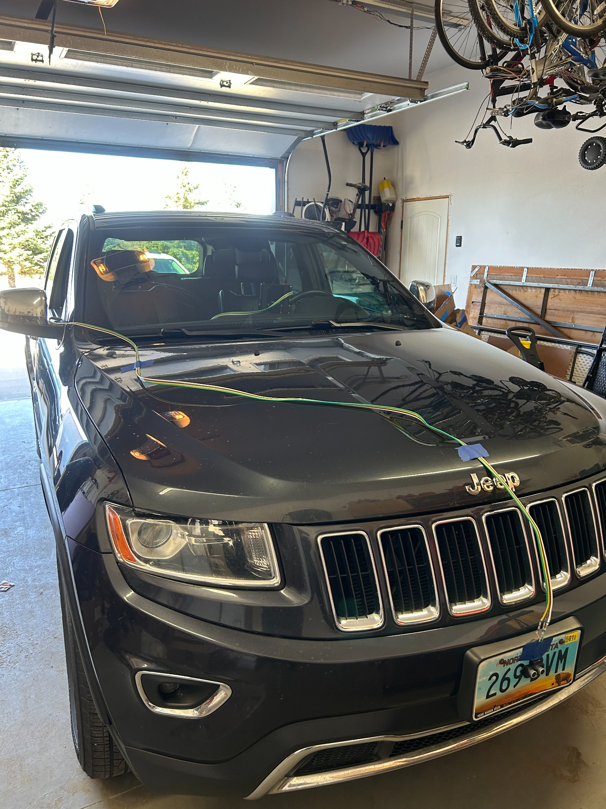
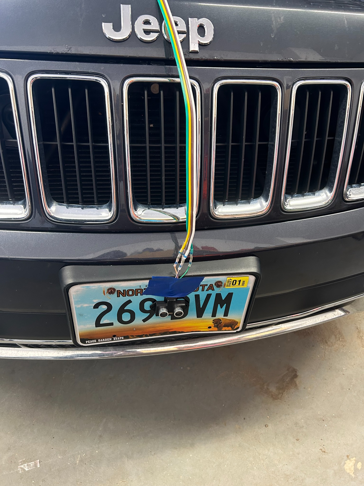
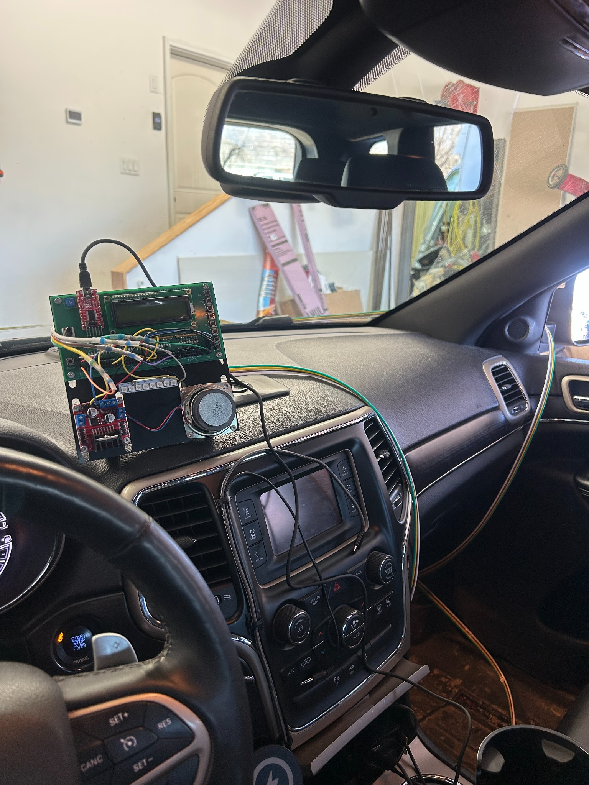
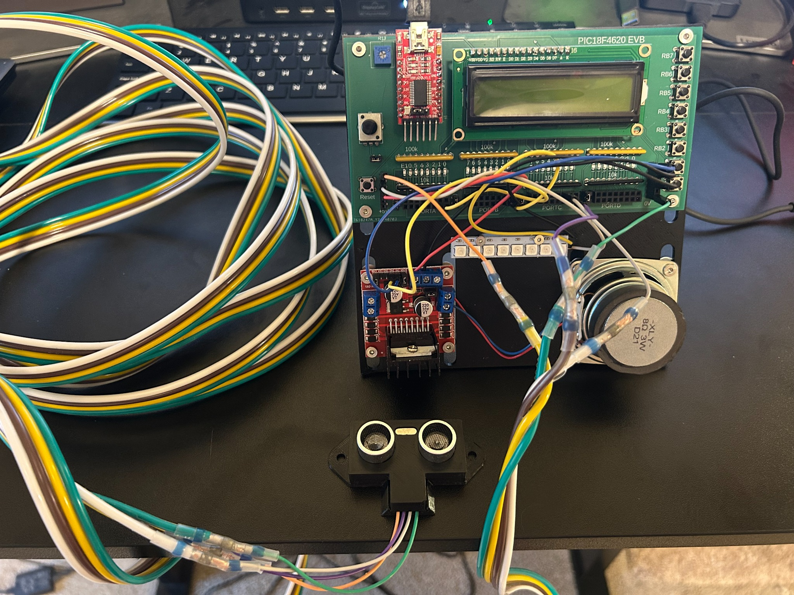

# PIC18F4620 Automotive Reverse / Backup Alarm

**ECE 376 Final Project — Josh Pfaff and Aiden Sagaser**

This project is an embedded automotive reverse/backup alarm built around a **PIC18F4620** microcontroller. An ultrasonic range sensor measures the distance to an object behind/in front of the vehicle, and the PIC uses that measurement to control three forms of feedback:

- 🔊 A speaker driven through an H-bridge
- 💡 An 8-pixel NeoPixel display
- 📟 A character LCD showing the measured distance

The system was programmed in **MPLAB 8 using PIC18 C code**, with inline assembly used for the timing-sensitive NeoPixel data stream.

---

## Project Demonstration

The demonstration shows the completed system installed in a Jeep and operating as an automotive proximity/reverse alarm.

The original ECE 376 project documentation also contains a YouTube demonstration:

[YouTube demonstration](https://www.youtube.com/shorts/kaBa0mTje7s)

---

## Project Overview

The goal of the project was to create a system that measures the distance to the nearest object and gives the driver increasingly urgent feedback as the object gets closer.

The project requirements specify the following behavior:

| Distance            | NeoPixels | Audible warning          |
| ------------------- | --------- | ------------------------ |
| Greater than 100 cm | Off       | No beep                  |
| 40–99.9 cm          | Green     | Slow beeping             |
| 20–39.9 cm          | Yellow    | Faster beeping           |
| Less than 20 cm     | Red       | Rapid/continuous warning |

The ECE 376 design documentation describes the system as measuring distance with an ultrasonic range sensor, displaying the distance on an LCD, changing the NeoPixel color according to distance, and increasing the beep rate as the object gets closer.

---

## Hardware

### Main Components

| Component                   | Purpose                                                                   |
| --------------------------- | ------------------------------------------------------------------------- |
| **PIC18F4620**              | Main microcontroller / embedded-system brain                              |
| Ultrasonic range sensor     | Measures distance to the nearest object                                   |
| Speaker                     | Produces the audible backup warning                                       |
| H-bridge                    | Drives the speaker                                                        |
| 8 NeoPixels                 | Provides visual distance indication                                       |
| Character LCD               | Displays measured distance                                                |
| PIC18F4620 evaluation board | Provides the microcontroller, LCD interface, I/O, and supporting hardware |

The project documentation specifically identifies the PIC board as the brain of the embedded system and lists the range sensor, speaker/H-bridge, NeoPixels, and LCD as the major system components.

---

## Hardware Photos

### Complete prototype



The complete prototype contains the PIC18F4620 evaluation board, LCD, speaker/H-bridge circuitry, NeoPixel circuitry, and ultrasonic range sensor.

### Front ultrasonic sensor



The ultrasonic sensor is mounted near the front license plate area of the Jeep. The sensor provides the echo pulse used by the PIC to calculate distance.

### Installed vehicle system



The prototype was extended from the bench setup into a vehicle installation. The wiring runs between the sensor at the front of the vehicle and the electronics inside the vehicle.

### PIC18F4620 evaluation board



The evaluation board shown in the project contains the **PIC18F4620** and the LCD interface. The external circuits connect to the PIC's I/O ports.

---

## PIC18F4620 I/O and Timer Usage

The source code uses the following important PIC resources:

| PIC resource     | Function                                  |
| ---------------- | ----------------------------------------- |
| **RA1**          | Speaker / H-bridge control                |
| **RB0**          | NeoPixel data output                      |
| **RC0**          | Ultrasonic sensor trigger/transmit output |
| **RC2 / CCP1**   | Ultrasonic echo capture input             |
| **PORTD**        | LCD interface through `lcd_portd.c`       |
| **Timer0**       | Generates the ultrasonic trigger timing   |
| **Timer1**       | Extends the measurement time base         |
| **CCP1 Capture** | Measures the ultrasonic echo pulse width  |

The code configures the ports with:

```c
TRISA = 0x00;
TRISB = 0xFE;
TRISC = 0x04;
TRISD = 0x00;
TRISE = 0x00;
ADCON1 = 0x0F;
```

This makes the appropriate pins outputs while leaving the ultrasonic echo input on RC2.

---

## How the Distance Measurement Works

The ultrasonic sensor is triggered periodically by **Timer0**.

When the ultrasonic sensor returns an echo, the PIC uses **CCP1 capture** to measure the width of the echo pulse.

The interrupt service routine records the start and end times:

```c
TIME0 = TIME + CCPR1;
...
TIME1 = TIME + CCPR1;
dT = TIME1 - TIME0;
```

The resulting time measurement is converted into distance:

```c
mm = (dT * 1715) / 10000;
```

The calculated distance is then displayed on the LCD and used to select the warning zone.

---

## Interrupts

Three interrupt-driven functions are important to the design.

### Timer0 — Ultrasonic Trigger

Timer0 generates the periodic ultrasonic transmit signal. The interrupt toggles RC0:

```c
if (TMR0IF) {
    RC0 = !RC0;
    TMR0IF = 0;
}
```

The project requirements describe this as generating a **50 Hz square wave**, giving a 20 ms measurement interval.

### Timer1 — Extended Time Base

Timer1 provides the longer timing base needed to measure the ultrasonic echo:

```c
if (TMR1IF) {
    TIME = TIME + 0x10000;
    TMR1IF = 0;
}
```

### CCP1 — Echo Pulse Capture

CCP1 captures both the rising and falling edges of the ultrasonic echo pulse.

On the rising edge, the start time is saved. On the falling edge, the end time is saved and the difference is calculated:

```c
TIME0 = TIME + CCPR1;
...
TIME1 = TIME + CCPR1;
dT = TIME1 - TIME0;
```

This gives the PIC the pulse width needed for the distance calculation.

---

## Warning-Zone Software

The main loop compares the calculated distance against several thresholds.

```c
if (mm < 2000) {
    Beep();
    Zone = 1;
}
else if (mm < 3000) {
    Beep();
    Zone = 2;
    Wait_ms(50);
}
else if (mm < 4000) {
    Beep();
    Zone = 2;
    Wait_ms(120);
}
else if (mm < 7000) {
    Beep();
    Zone = 3;
    Wait_ms(250);
}
else if (mm < 10000) {
    Beep();
    Zone = 3;
    Wait_ms(450);
}
else {
    RA1 = 0;
    Zone = 0;
    Wait_ms(50);
}
```

Because the distance is represented in **tenths of a millimeter**, the thresholds correspond approximately to:

- `< 200 mm` → red
- `200–399 mm` → yellow
- `400–999 mm` → green
- `≥ 1000 mm` → LEDs off

The longer delays at greater distances make the audible warning slower when the object is farther away.

---

## NeoPixel Operation

The NeoPixels are controlled directly by the PIC through **RB0**.

The project uses a timing-sensitive assembly routine because NeoPixels require a precisely timed serial data stream.

The C function sends green, red, and blue values:

```c
PIXEL = GREEN;
asm(" call Pixel_8 ");

PIXEL = RED;
asm(" call Pixel_8 ");

PIXEL = BLUE;
asm(" call Pixel_8 ");
```

The assembly routine then sends the pixel data one bit at a time.

The program sends the same color to eight pixels, producing a single visual warning bar:

- **Red** — very close
- **Yellow** — caution
- **Green** — object detected at a safer distance
- **Off** — no nearby object

---

## Audible Warning

The speaker is controlled from **RA1** through an H-bridge.

The `Beep()` routine toggles RA1 repeatedly:

```c
for(i=0; i<20; i++) {
    RA1 = !RA1;
    for(j=0; j<1558; j++);
}

RA1 = 0;
```

The main loop controls the time between beeps based on the measured distance. As the object gets closer, the delay becomes shorter, making the warning sound increasingly frequent.

---

## LCD Display

The LCD is initialized with:

```c
LCD_Init();
```

The first line displays:

```text
Reverse Beeper
```

The second line displays the measured distance:

```text
Distance: #####
```

The LCD interface is provided through:

```c
#include "lcd_portd.c"
```

This allows the driver code to handle the LCD while the main program focuses on the range-sensing and warning logic.

---

## Software Structure

The program is organized into several major sections:

1. **Global variables**
   - Timing variables
   - NeoPixel data variable
   - LCD title string

2. **NeoPixel driver**
   - C function
   - Inline assembly for precise timing

3. **Interrupt service routine**
   - Timer0
   - Timer1
   - CCP1 capture

4. **Beep function**
   - Generates the speaker waveform

5. **Main routine**
   - Configures PIC I/O
   - Initializes the LCD
   - Configures timers and CCP1
   - Enables interrupts
   - Calculates distance
   - Selects warning zone
   - Updates the speaker and NeoPixels

---

## MPLAB 8 Development

The project uses the PIC18 development workflow used in ECE 376:

1. Create/open the PIC project in **MPLAB 8**.
2. Select the **PIC18F4620** as the target microcontroller.
3. Add the main C source file (`ReverseBeeper.C`).
4. Include the LCD driver file (`lcd_portd.c`).
5. Compile the project.
6. Program the PIC18F4620 evaluation board.
7. Test the ultrasonic sensor and each output device.
8. Use an oscilloscope to verify the timing signals and interrupt operation.

The source code uses the PIC18-specific include:

```c
#include <pic18.h>
```

and follows the MPLAB-era PIC18 C programming style used in the course.

---

## Testing and Validation

The project documentation reports that the measured distance was close to the actual measured distance.

### Distance test results

| Actual range (mm) | Measured range (mm) |
| ----------------: | ------------------: |
|               250 |                 248 |
|               200 |                 202 |
|               150 |                 151 |
|               100 |                  98 |
|                50 |                  53 |

These measurements demonstrate that the ultrasonic distance measurement was close to the reference distances used during testing.

The project documentation also reports that:

- The NeoPixels changed color near the programmed distance thresholds.
- The beeping became faster as the object moved closer.
- The LCD displayed the measured distance.
- Timer0 was tested with an oscilloscope.
- Timer1/CCP1 capture behavior was tested with an oscilloscope.
- The PIC board controlled all of the system components.

---

## Design Flow

The overall operation can be summarized as:

```text
              ┌─────────────────────┐
              │   Ultrasonic Sensor │
              └──────────┬──────────┘
                         │
                         ▼
              ┌─────────────────────┐
              │     PIC18F4620      │
              │                     │
              │ Timer0 → Trigger    │
              │ Timer1 → Time Base  │
              │ CCP1   → Echo       │
              └──────┬─────┬────┬──┘
                     │     │    │
              ┌──────▼─┐ ┌─▼──┐ ┌▼─────────┐
              │ Speaker│ │LCD │ │ NeoPixels│
              │+H-Bridge│ │    │ │  RB0     │
              └────────┘ └────┘ └──────────┘
```

The PIC continuously measures the sensor echo, converts that measurement to distance, displays the distance, and selects the appropriate audible and visual warning.

---

## Results

The completed system combines sensing, timing, digital output, display control, and interrupt-driven embedded programming into one automotive-style application.

The final prototype demonstrates:

- **PIC18F4620 embedded control**
- **Ultrasonic distance measurement**
- **Timer interrupts**
- **CCP input capture**
- **Inline assembly**
- **NeoPixel control**
- **LCD interfacing**
- **H-bridge speaker control**
- **Distance-based warning logic**

The project documentation states that the system used a range sensor, speaker, H-bridge, NeoPixels, and LCD, and that the PIC board served as the embedded-system controller. fileciteturn0file0L288-L298

---

## Project Files

```text
Reverse_Beeper_Project/
│
├── README.md
│
└── assets/
    ├── hardware_01.jpg
    ├── front_sensor.jpg
    ├── installed_in_vehicle.jpg
    ├── pic18f4620_board.jpg
    └── demo_video.MOV
```

---

## Authors

**Josh Pfaff**  
**Aiden Sagaser**

**Course:** ECE 376

**Project:** Automotive Reverse / Backup Alarm
